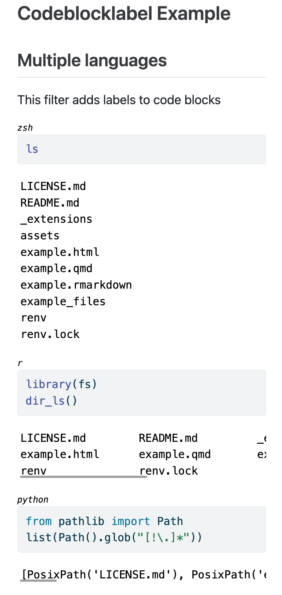

# Codeblocklabel Extension For Quarto

This will annotate codeblocks with the language of the codeblock. Potentially useful for documents with multiple languages in use.



**Note**: The `filename` code chunk option won't work with this filter enabled.

**Limitations**: Only implemented for html output.


## Installing

```bash
quarto add jofrhwld/codeblocklabel
```
This will install the extension under the `_extensions` subdirectory.
If you're using version control, you will want to check in this directory.

## Using

Simply add the following to your document header.

```yaml
filters:
  - codeblocklabel
```

This will work for both executed code blocks as well as non-executed codeblocks.

## Example

Here is the source code for a minimal example: [example.qmd](example.qmd).

